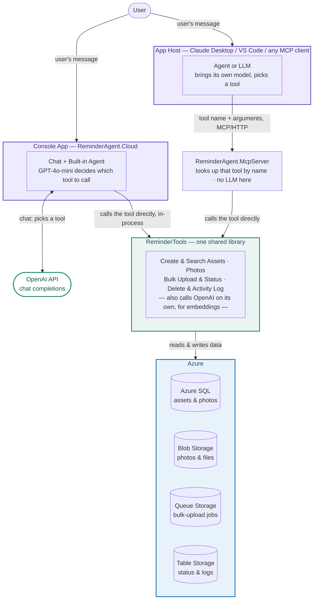
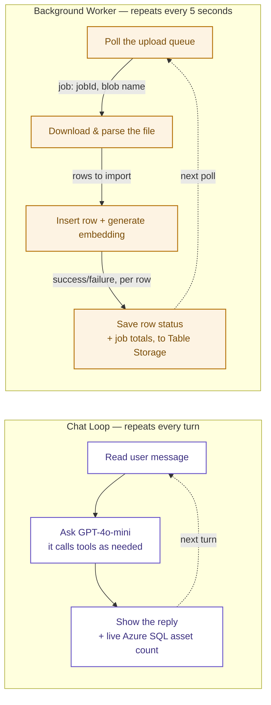
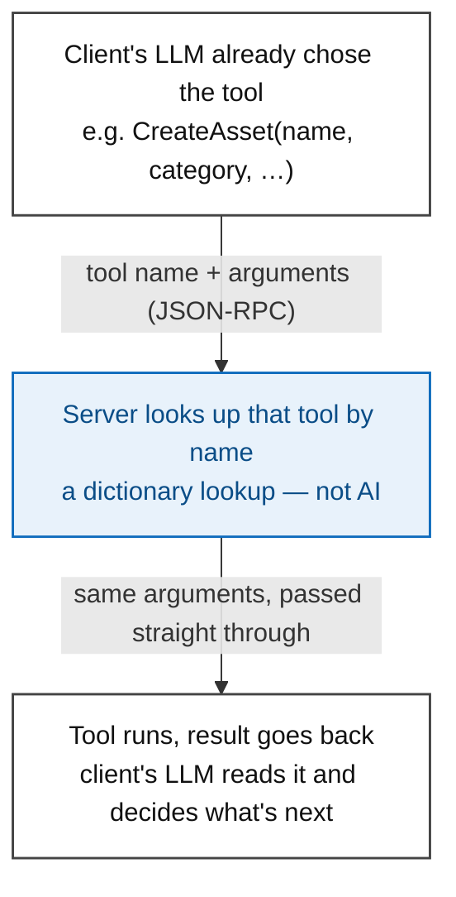
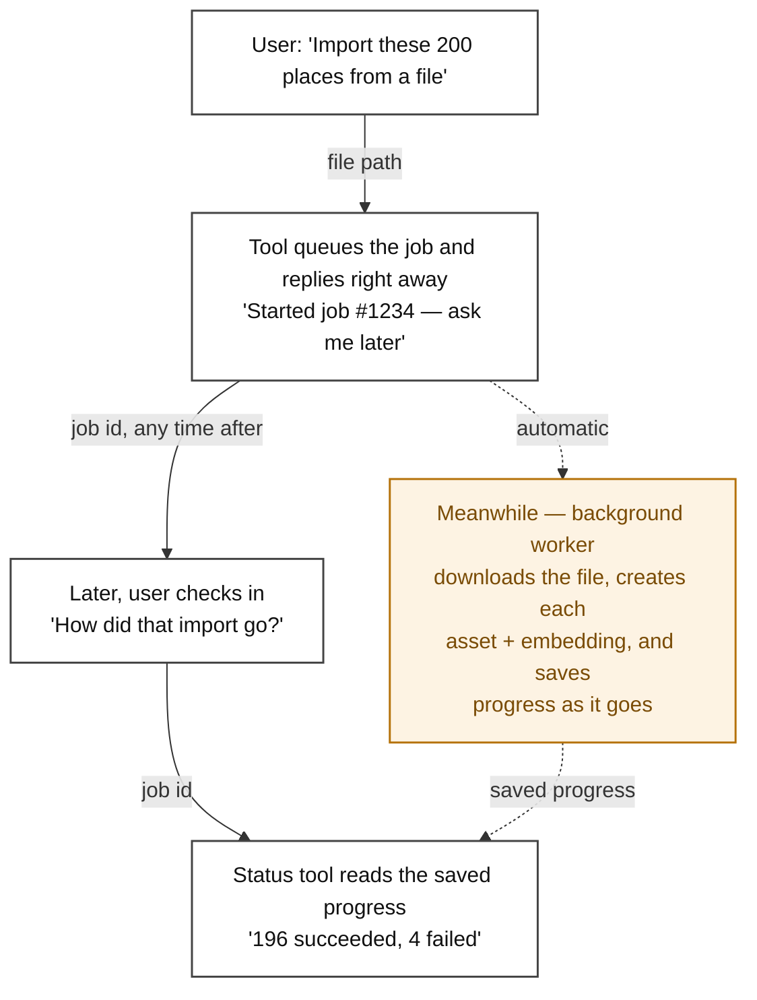

# ReminderAgent Blueprint

Two front doors, one shared core. ReminderAgent can be reached two ways — a console
app with its own built-in agent, or any MCP client talking to
`ReminderAgent.McpServer`. Both paths use the same tools and the same Azure backend.
One diagram shows that shape; the rest zoom into each piece.

**Color key**, used consistently below:
- 🟣 violet — a process that hosts an agent (Console App, App Host)
- 🔵 blue — an Azure-managed resource
- 🟢 green — OpenAI (external)
- 🟠 amber — runs in the background / asynchronously

## 1. Overview — how a request reaches Azure, either way

The console has its own built-in agent and calls tools directly. An MCP client
instead sends its request over MCP/HTTP to the MCP server; the server itself has no
agent — it just runs the tool the client already chose. Either way, there is exactly
**one** path into the tool library. OpenAI is a separate, independent conversation on
the side: the console asks it which tool to call, and — shown as a note on the tool
library itself, not a second arrow in — the tool library separately asks it for
embeddings once it's already running. The App Host does **not** call OpenAI at all;
its agent brings its own model, which may not be OpenAI's.

## 2. Console app — one process, two things happening

The console runs a chat loop for the person typing, and a background worker for bulk
uploads, at the same time, in the same process. Neither blocks the other: a slow bulk
import never freezes the chat, and a long conversation never delays the queue.

`Insert row + generate embedding` really does write to Azure SQL — it calls the same
data-access method the `CreateAsset` tool calls internally, just without going through
the tool itself. What it skips is everything the tool wraps around that call:
validating the row, parsing an event date, and logging the action.

## 3. MCP server — looks up the tool, doesn't choose it

The client's own LLM is what reads the user's request and picks a tool — the server
never sees plain language. It only ever sees an exact tool name and gets the
arguments ready. "Looks up" in the middle step means matching an exact name, the way a
dictionary lookup does — not understanding.

> **Note:** the background worker from diagram 2 only exists inside the console app —
> a bulk upload started through MCP alone will queue but never finish unless the
> console is also running.

## 4. Bulk upload — reply now, finish later

Importing hundreds of rows takes too long to make the user wait. So the tool replies
immediately, and the real work happens in the background. The job id is the thread
that ties the quick reply to the slow work happening behind it.

